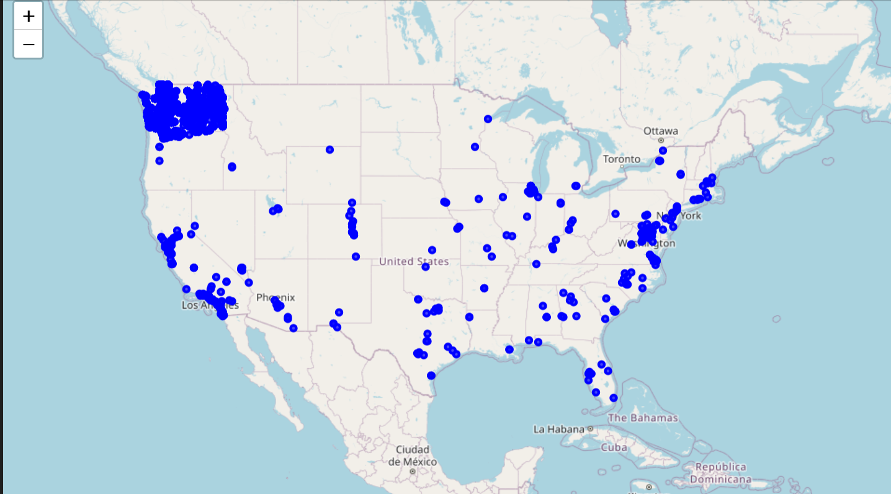

# Global Solution - Gerenciamento de Carregamento de Veículos Elétricos

## Equipe
- **Gabriel Moura** - 93940
- **Heitor Mancini** - 94288

## Descrição do Problema
O crescimento de veículos elétricos (VEs) apresenta desafios significativos na infraestrutura de carregamento, incluindo a previsão de demanda e a alocação eficiente de recursos energéticos. Este projeto visa desenvolver um sistema de Inteligência Artificial para otimizar o gerenciamento do carregamento de VEs, com foco na redução de custos e na melhoria da eficiência.

## Metodologia Utilizada
### Análise de Dados
- Três datasets contendo registros de veículos elétricos nos EUA, carregadores cadastrados e dados de carregamentos em um período de VEs, foram utilizados.
- Análise exploratória com visualizações para compreender padrões e tendências.
- Geração de mapas utilizando a biblioteca `folium`, destacando localizações de VEs.

### Machine Learning
- **Modelos Utilizados:**
  - Regressão Linear (`LinearRegression`)
  - Random Forest Regressor (`RandomForestRegressor`)
- **Processos:**
  - Divisão dos dados com `train_test_split`.
  - Avaliação de desempenho usando `mean_squared_error`.
  - Predição da demanda de carregamento e consumo energético.

## Resultados Obtidos
- **Mapas:** Identificação das regiões com maior concentração de VEs, como Washington, auxiliando na definição estratégica de locais para estações de carregamento.

  
- **Modelagem Preditiva:** Geração de previsões de demanda com erros médios quadráticos aceitáveis, destacando a viabilidade de aplicar Machine Learning ao gerenciamento de recursos.

## Conclusões
- A aplicação de técnicas de IA mostrou-se promissora para resolver desafios de infraestrutura de VEs.
- Resultados indicam áreas-chave para implantação de carregadores, otimizando custos e recursos energéticos.
- Melhorias futuras incluem integração com dados em tempo real e adoção de técnicas avançadas de Deep Learning.
